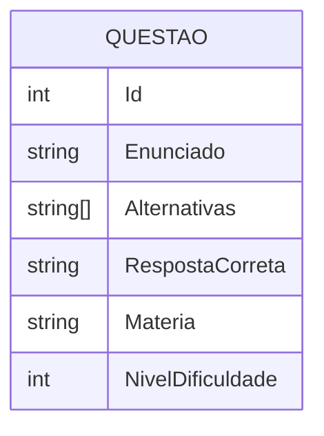
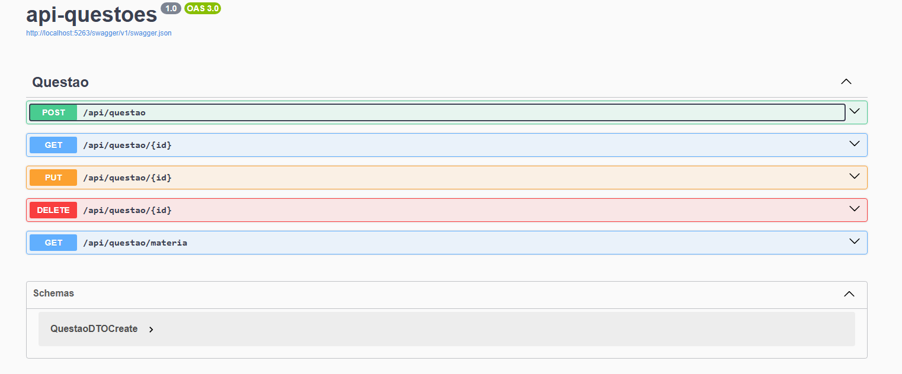

# 📚 API REST de Questões 📝

Esta API faz parte do projeto **App de Questões**, desenvolvida em **.NET 8** para gerenciar **questões de múltipla escolha**, permitindo **criação, consulta, atualização e exclusão**. 

---

## 📂 Sumário

* [⚒️ Tecnologias utilizadas](#️-tecnologias-utilizadas)
* [🔧 Funcionalidades](#-funcionalidades)
* [🗄️ Database Modeling](#️-database-modeling)
* [🗃️ Configuração da Conexão](#️-configuração-da-conexão)
* 🔍 Fazendo Requisições

  * [❓ Questões](#-gerenciamento-de-questões)
* [🚀 Como Executar o Projeto](#-como-executar-o-projeto)
* [📗 Documentação Swagger](#-documentação-swagger)
* [🚫 Observações](#-observações)

---

## ⚒️ Tecnologias utilizadas

- .NET 8
- ASP.NET Core
- Entity Framework Core
    * Tools
    * Design
    * SqlServer
- SQL Server 
- Swagger (para documentação da API)
- Git/GitHub

---

## 🔧 Funcionalidades

* **Questões**

  * **Criar** questão
  * **Buscar** questão por ID
  * **Buscar** questões por matéria
  * **Atualizar** questão
  * **Deletar** questão

---

## 🗄️ Database Modeling



---

## 🗃️ Configuração da Conexão

Configure a connection string em `appsettings.json` ou `appsettings.Development.json`:

```json
{
  "ConnectionStrings": {
    "DefaultConnection": "Server=localhost\\sqlexpress;Initial Catalog=dbQuestoes;Integrated Security=True;TrustServerCertificate=True"
  }
}
```

* **Server:**  `localhost`
* **Database:** `dbQuestoes`

---

## 🔍 Fazendo Requisições (api/questao)

### 📝 Gerenciamento de Questões

| Method    | Endpoint             | Ação                                 |
| --------- | -------------------- | ------------------------------------ |
| 🟢 POST   | /api/questao         | Cria uma questão                     |
| 🔵 GET    | /api/questao/{id}    | Retorna questão pelo ID              |
| 🔵 GET    | /api/questao/materia | Retorna questões por matéria         |
| 🟠 PUT    | /api/questao/{id}    | Atualiza a questão do ID selecionado |
| 🔴 DELETE | /api/questao/{id}    | Deleta a questão do ID selecionado   |

### 🟢 Criando uma Questão

**Body (JSON):**

```json
{
  "enunciado": "Qual é a capital da França?",
  "alternativas": ["Paris", "Roma", "Londres", "Berlim"],
  "respostaCorreta": "Paris",
  "materia": "Geografia",
  "nivelDificuldade": 1
}
```

---

## 🚀 Como Executar o Projeto

### 🔧 Pré-requisitos

* [SDK .NET 8](https://dotnet.microsoft.com/pt-br/download/dotnet/8.0)
* SQL Server ou MySQL instalado

1️⃣ Clone o repositório:

```bash
git clone https://github.com/brunopaz8/api-questoes.gi
cd api-questoes
```

2️⃣ Restaure pacotes e aplique migrations:

```bash
dotnet restore
dotnet ef database update
```

3️⃣ Execute a API:

```bash
dotnet run
```

A API estará disponível em: `http://localhost:5263`

---

## 📗 Documentação **Swagger**

A API conta com documentação interativa via **Swagger UI**, facilitando testes e visualização dos endpoints. Após iniciar a aplicação, acesse:

🟢 **Swagger UI:** [http://localhost:5263/swagger/index.html](http://localhost:5263/swagger/index.html)



---

## 🚫 Observações

* Configure corretamente a `connectionString` no `appsettings.json`.
* Execute migrations manualmente ao rodar localmente (`dotnet ef database update`).
* Certifique-se de que o banco esteja em execução antes de subir a API.
* Essa não é a versão final ainda precisamos subir a api na nuvem.
